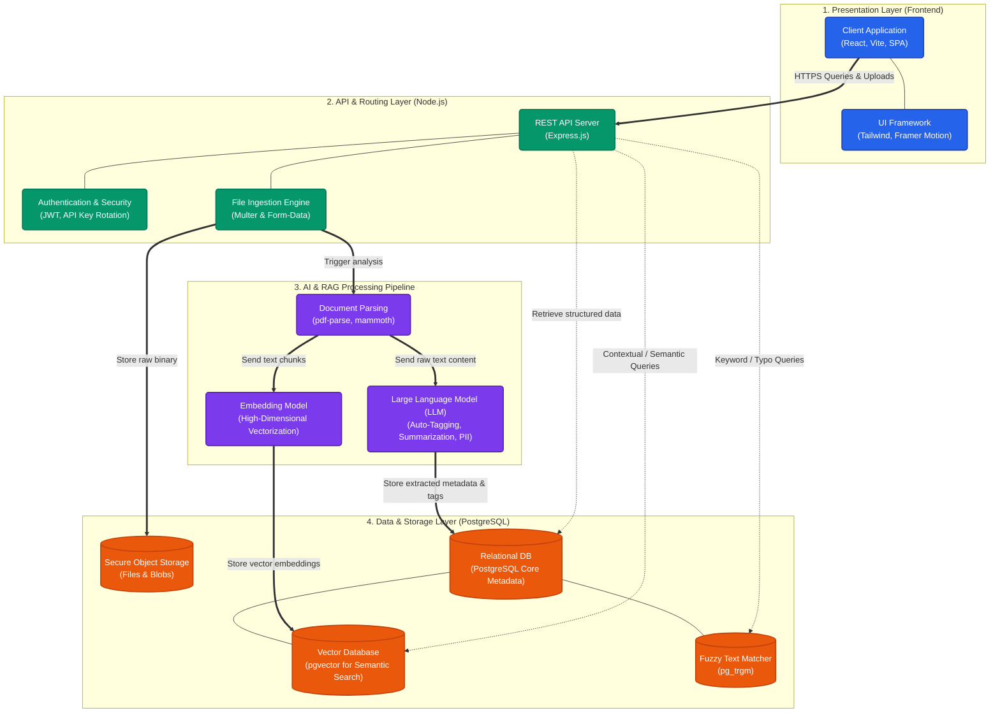

# CloudSense System Architecture

This document outlines the high-level architecture of the CloudSense platform, illustrating the flow of data from the client presentation layer through the API, AI processing pipeline, and down to the persistent storage and vector databases.

## High-Level Architecture Diagram

## Architecture Components

The system is decoupled into four highly scalable layers:

### 1. Presentation Layer (Client)
A fast, modern Single Page Application (SPA) built with **React** and bundled via **Vite**. It handles all user interactions, visual feedback, and file drag-and-drop operations, communicating exclusively with the backend REST APIs.

### 2. API & Routing Layer (Backend)
The core bridge built on **Node.js / Express**. It handles request validation, user authentication (via JWT), and implements a robust **API Key Rotation** mechanism to ensure uninterrupted access to AI resources during burst traffic.

### 3. AI & RAG Processing Pipeline (Intelligence)
Upon file upload, documents are immediately routed to this pipeline:
- **Text Extraction:** Raw text is ripped from PDFs, Text, and Word documents.
- **Large Language Model (LLM):** The raw text is passed to an advanced LLM responsible for intelligent auto-tagging, categorizing, document summarization, and detecting Sensitive / PII data with high accuracy.
- **Embeddings:** Text is converted into mathematical vectors using an Embedding Model. This serves as the foundation for the **Retrieval-Augmented Generation (RAG)** system and semantic search.

### 4. Data & Storage Layer (Persistence)
The foundational data layer powered by an advanced **PostgreSQL** deployment (e.g., Supabase):
- **Object Storage:** Securely holds the raw binary files (images, PDFs, documents).
- **Relational Metadata:** Stores user schemas, tags, relationships, and file metadata.
- **pgvector Integration:** Stores the high-dimensional vectors generated by the embedding model, allowing for lighting-fast nearest-neighbor calculations (Semantic Search).
- **pg_trgm Integration:** Handles baseline fuzzy string matching for traditional search queries containing typos.

## Workflow Patterns

*   **Ingestion:** Client Upload $\rightarrow$ Node.js Server $\rightarrow$ Object Storage & AI Pipeline $\rightarrow$ Database Metadata + Vector Writes.
*   **Search (Semantic):** Client Query $\rightarrow$ Embedding Generation on Query $\rightarrow$ High-dimensional Cosine Similarity Search (`pgvector`) $\rightarrow$ Ranked Results to Client.
*   **Search (Fuzzy):** Client Query $\rightarrow$ Trigram Text Matching (`pg_trgm`) $\rightarrow$ Rapid partial-match Results to Client.
*   **Chat (RAG):** User Question $\rightarrow$ LLM contextualized with previously extracted Document Text $\rightarrow$ AI-generated conversational response.
