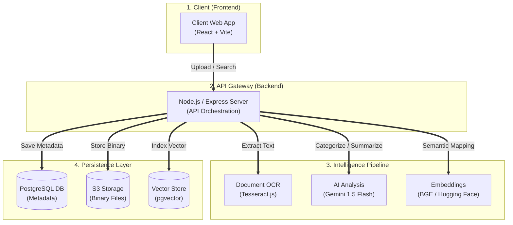

# CloudSense High-Level System Design

This document provides a clean, streamlined overview of the CloudSense architecture, focusing on the core logical layers and data flow.

## 🏛️ Architecture at a Glance

---

## 🏗️ Core Components

### 1. Presentation Layer (React)
A modular, lightning-fast UI built on **React 19**. It handles user interactions, authenticated file streaming, and provides the **Intelligence Center** dashboard for security metrics.

### 2. Orchestration Layer (Node.js)
The brain of the system. It manages the complex lifecycle of a file upload:
- **Security Check:** Validates auth tokens.
- **Deduplication:** Uses SHA-256 to prevent redundant storage.
- **Workflow Management:** Parallelizes AI tasks.

### 3. Intelligence Pipeline
A series of specialized AI agents that "read" and understand your data:
- **Visual Intelligence:** OCR for image-based documents.
- **Textual Intelligence:** LLM for high-level summaries and PII detection.
- **Semantic Intelligence:** Vector embeddings for context-aware search.

### 4. Hybrid Cloud Storage (Supabase)
A multi-modal storage strategy:
- **Relational Data:** Structured file metadata and user profiles.
- **Unstructured Data:** Raw documents and images.
- **Vector Data:** High-dimensional numerical indices for semantic "concept" matching.

## 🔄 The "Smart Upload" Lifecycle
1. **Intake:** User drags file $\rightarrow$ Server hashes content.
2. **Analysis:** Server extract text $\rightarrow$ LLM identifies sensitive data (PII).
3. **Encoding:** Text is converted into a 384-dimensional vector.
4. **Finalization:** Binary is stored securely; Metadata + Vector are indexed for instant retrieval.
